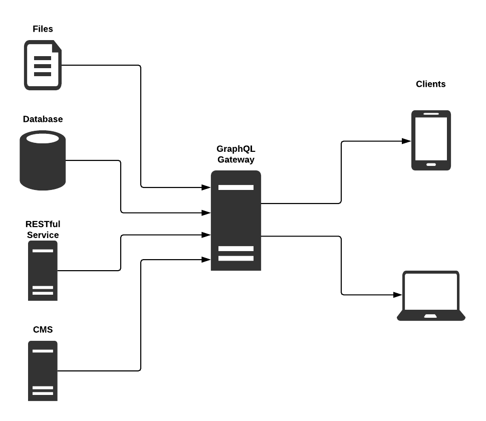
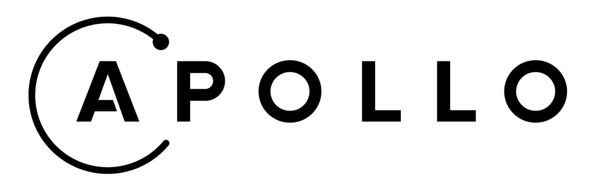
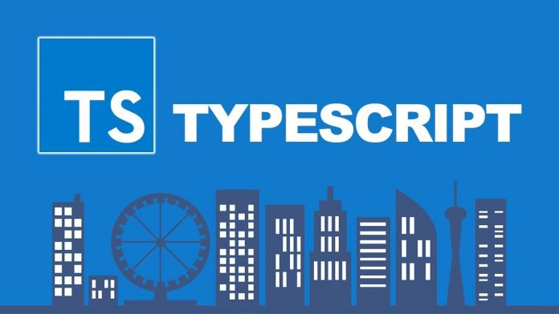

[Link for demo project](https://react-demo-two-mocha.now.sh/)

# Why I'm using those technologies.

## Graphql


#### Advantages:

1. **Client not management data from the server**
   The server is only responsible for publishing the shape of the object graph (a.k.a. the schema) and then letting the client query it any way it wants. For example:

   ```
    {
      book(id: "clean-code") {
        name
        authors {
          name
          books {
            name
          }
        }
      }
    }
   ```

2. **Ask for what you need and get exactly that**
   This approach improves the performance significantly, especially on mobile devices, where bandwidth and processing power are at a premium.

   ```
   {
    books {
      name
      publishDate
    }
   }
   ```

3. **Access multiple data sources from a single endpoint**
   GraphQL provides access to data from one or more data sources. The client doesn’t care where the data physically resides. All it knows about is the logical model of the data (the schema). It is up to the server to fetch the data from one or more sources and stitch it together to conform to the schema. The diagram below shows some potential data sources such as files, databases, REST APIs, and content management systems.
   

#### Disadvantages:

1. **We need to spend more time on architecture tasks.**
   When we will start the project, we need set up graphql-server (node.js), create schemes and types for data management

## Apollo (framework for GraphQL)



#### Advantages:

1. **Apollo's Ecosystem**
   While GraphQL is in its early stages, the Apollo ecosystem offers solutions for many of its challenges. Beyond that we can see how much the ecosystem is growing, because the company announces an update for Apollo or another library that can be used with Apollo's tech stack at every other technology conference. This even takes GraphQL beyond the network layer and remote data, offering a state management solution for local data, too.
2. **The Company and Community behind Apollo**
   The company behind Apollo is pouring lots of resources into its success. They are also active in open source, offering in-depth articles about their products, supported by an established presence at the conferences.
3. **Apollo Libraries**
   Apollo offers plenty of libraries for implementing an effective GraphQL tech stack for JavaScript applications, and their libraries are open-sourced to be more manageable. For instance, Apollo Link provides an API for chaining different features into a GraphQL control flow. This makes it possible for automatic network retries or RESTful API endpoints instead of a GraphQL endpoints (the endpoints can be used together, too).
4. **Apollo's Features**
   Apollo comes with built-in features to pull all the complexity out of applications and handle the intersection between client and server applications. For instance, Apollo Client caches requests, which are not made twice when the result is already in the cache. The function provides a performance boost for applications, saving valuable network traffic. Also, Apollo Client normalizes data, so nested data from a GraphQL query is stored in a normalized data structure in the Apollo Client Cache. Data can be read from the Apollo Client Cache by an identifier, without looking up an "article" entity in an "author" entity. Beyond caching and normalization, Apollo Client comes with many more features like error management, support for pagination and optimistic UI, prefetching of data, and connection of the data layer (Apollo Client) to the view layer (e.g. React).
5. **Convenient Development Experience**
   Using Apollo for JavaScript applications is becoming easier every day. The community is pushing out tools for implementation. There are development tools available as browser extensions, third-party tools to perform GraphQL operations such as GraphiQL, and libraries to simplify developing Apollo applications. For instance, the Apollo Boost library provides an almost zero-configuration Apollo Client setup to get started with GraphQL for client-side applications. Apollo takes away all the boilerplate implementation that comes with the GraphQL reference implementation in JavaScript.

#### Disadvantages:

1. **Under Construction**
   The Apollo team and community implements many new features in a rapid pace, but going so fast comes with a price. Searching for solutions sometime leads to GitHub, because there is little other information on the subject.

## Next.js (framework for React)


#### Advantages:

1. **Automatic Code Splitting**
   Code splitting allows us to split our application code up into a series of lightweight bundles. Instead of loading all of our JavaScript, our application will only load the bundle needed. Webpack is the tool most associated with this process. Instead of having to configure webpack to perform this, we can rely on Next.js.
2. **Prefetching**
   Prefetching picks off where code splitting leaves off. Next.js allows all of our optimized bundles of code to be lazily-loaded behind the scenes.

   To harness the benefits of prefetching, all users need to do is add the prefetch attribute to their Link components.

   ```
   // Will NOT prefetch route
   <Link href="/blog" />
   // Will have response cached and ready to go :)
   <Link prefetch href="/blog" />
   ```

3. **Server-side out of the box**
   Next.js allows all of our application code to utilize server-side rendering (SSR) out of the box, thus providing the benefits that come with this:
   - eliminate the need for the client to download code by having the HTML ready in the response.
   - can provide users with an initial render of the application’s view while loading the code in the background.
     For more details, you can read the post of Walmart Labs [The Benefits of Server Side Rendering Over Client Side Rendering.](https://medium.com/walmartlabs/the-benefits-of-server-side-rendering-over-client-side-rendering-5d07ff2cefe8)
4. **Ready for production**
   Next.js is super fast and it's optimised for smaller build size making your web
   app size realy small and faster.
5. **Zero Setup**
   Next.js also handles most of your setup process such as _file system_, _routing_, _hot code reloading_ and _universal rendering_.
6. **Smaller learning curve**
   You will still write React, you will not experience the Angular 1 and Angular 4 effect. Next handles somethings that will save you a lot of time such as routing.

## TypeScript



#### Advantages:

1. Types have a proven ability to enhance code quality and understandability.
2. Types increase your agility when doing refactoring. It’s better for the compiler to catch errors than to have things fail at runtime.
3. Types are one of the best forms of documentation you can have. The function signature is a theorem and the function body is the proof.
4. Types make the code more readable. It helps the developer remember faster what each piece of code is supposed to do. Hence, the developer can add and change the current code faster.
5. Very good code completion and IntelliSense. Intellisense provides active hints as a code is added.
6. Refactoring with TypeScript tools is easier and faster.

[](https://zeit.co/new/project?template=https://github.com/zeit/next.js/tree/canary/examples/with-linaria)
